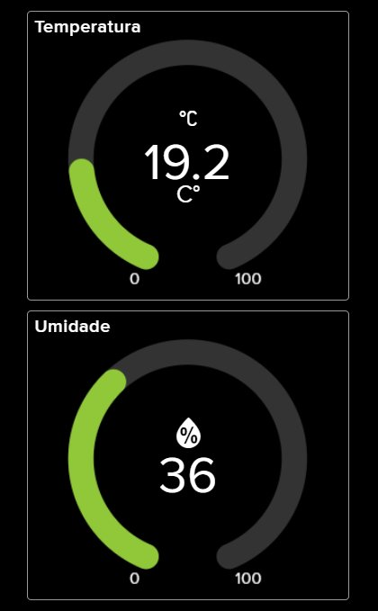

# 🌡️ Rede IoT com ESP-NOW — Monitoramento Ambiental

> Sistema de monitoramento de temperatura e umidade em tempo real usando ESP32, protocolo ESP-NOW e Adafruit IO. Desenvolvido para a disciplina de **Sistemas Ciberfísicos Colaborativos** — Universidade de Fortaleza (UNIFOR).

---

## 📡 Visão Geral

Este projeto implementa uma rede IoT de dois nós baseada em ESP32 para coleta e transmissão de dados ambientais. Um nó **sensor** (EQUIPE03) lê temperatura e umidade via DHT11 e os envia por ESP-NOW; um nó **gateway** recebe os dados, confirma o recebimento com ACK e os publica na nuvem via MQTT para visualização em tempo real.

```
┌──────────────────┐        ESP-NOW        ┌─────────────────────┐        MQTT        ┌─────────────────┐
│   ESP32 Sender   │  ──────────────────▶  │   ESP32 Gateway     │  ────────────────▶ │  Adafruit IO    │
│   (EQUIPE03)     │  ◀──────────────────  │   (GATEWAY)         │                    │  Dashboard      │
│   Sensor DHT11   │        ACK            │   WiFi + Fila       │                    │  Temp + Umidade │
└──────────────────┘                       └─────────────────────┘                    └─────────────────┘
```

---

## ✨ Funcionalidades

- **Leitura de sensores** — temperatura e umidade com DHT11
- **Comunicação sem roteador** — protocolo ESP-NOW ponto a ponto (broadcast)
- **Confirmação de entrega** — sistema de ACK com até 3 retentativas e timeout de 2s
- **Fila de pacotes** — buffer circular no Gateway para absorver picos de recepção
- **Publicação em nuvem** — envio via MQTT para Adafruit IO (feeds separados)
- **Filtragem por equipe** — pacotes identificados por nome (`EQUIPE03`) para evitar colisões em redes multi-equipe

---

## 🧰 Hardware e Tecnologias

| Componente | Função |
|---|---|
| ESP32 (×2) | Microcontrolador principal — Sender e Gateway |
| DHT11 | Sensor de temperatura e umidade (pino 18) |
| ESP-NOW | Protocolo de comunicação sem fio ponto a ponto |
| MQTT (porta 1883) | Protocolo de mensagens para publicação em nuvem |
| Adafruit IO | Dashboard de visualização em tempo real |
| Arduino Framework | Ambiente de desenvolvimento |

---

## 🏗️ Arquitetura

### Camada de Borda — `sender.ino`

O ESP32 **Sender** opera no modo `WIFI_STA` no canal 6 e envia pacotes estruturados via broadcast (`FF:FF:FF:FF:FF:FF`). Após cada envio, aguarda um pacote de ACK do Gateway. Se não receber dentro do timeout (2s), reenvia — até 3 tentativas.

**Estrutura do pacote de dados:**
```cpp
typedef struct {
  char     nome[20];       // Identificador da equipe
  float    temperatura;    // Leitura do DHT11 (°C)
  float    umidade;        // Leitura do DHT11 (%)
  uint32_t contador;       // Número de sequência
} DataPacket;
```

**Estrutura do ACK:**
```cpp
typedef struct {
  char     nome[20];       // "GATEWAY"
  uint32_t contador;       // Espelha o contador recebido
} AckPacket;
```

### Camada de Comunicação e Nuvem — `gateway.ino`

O ESP32 **Gateway** recebe pacotes ESP-NOW, envia ACK imediatamente e enfileira o pacote em um buffer circular (tamanho 10). O loop principal processa a fila, publicando temperatura e umidade em feeds separados do Adafruit IO.

```
onReceive()  →  valida nome  →  enfileira  →  envia ACK
loop()       →  processa fila  →  publica MQTT (temp + umid)
```

---

## 📂 Estrutura do Repositório

```
📦 rede-iot-espnow/
├── 📁 sender/
│   └── sender.ino          # Código do nó sensor (EQUIPE03)
├── 📁 gateway/
│   └── gateway.ino         # Código do nó gateway + MQTT
├── 📁 assets/
│   └── dashboard-adafruit-io.png   # Screenshot do dashboard
├── 📄 README.md
└── 📄 Relatorio.docx       # Relatório técnico completo
```

---

## ⚙️ Como Usar

### 1. Dependências

Instale as bibliotecas no Arduino IDE / PlatformIO:

```
DHT sensor library      — Adafruit
Adafruit MQTT Library   — Adafruit
ESP32 Arduino Core      — Espressif
```

### 2. Configuração do Gateway

Edite as credenciais em `gateway.ino` antes de fazer upload:

```cpp
#define WLAN_SSID  "SEU_WIFI"
#define WLAN_PASS  "SUA_SENHA"
#define AIO_USERNAME "seu_usuario_adafruit"
#define AIO_KEY      "sua_chave_adafruit"
```

### 3. Configuração de Canal

O Sender fixa o canal Wi-Fi em **6**. Certifique-se de que o Gateway conecta ao Wi-Fi em um roteador que opere no mesmo canal, ou ajuste:

```cpp
esp_wifi_set_channel(6, WIFI_SECOND_CHAN_NONE);
```

### 4. Upload

Faça upload do `gateway.ino` primeiro, anote o MAC do Gateway se necessário, depois faça upload do `sender.ino`. Abra o Monitor Serial (115200 baud) em ambos para verificar a comunicação.

---

## 📊 Dashboard

Os dados são exibidos em tempo real no Adafruit IO com dois gauges:

| Feed | Faixa | Descrição |
|---|---|---|
| `Temperatura` | 0 – 100 °C | Leitura do DHT11 em graus Celsius |
| `Umidade` | 0 – 100 % | Umidade relativa do ar |

<p align="center">
  
</p>

<p align="center"><i>Dashboard em tempo real: 19.2 °C de temperatura e 36% de umidade relativa.</i></p>

---

## 🔄 Fluxo de Comunicação

```
[Sender]                          [Gateway]
   │                                  │
   │── DataPacket (broadcast) ───────▶│
   │                                  │── enfileira pacote
   │                                  │── envia ACK
   │◀─ AckPacket ─────────────────────│
   │                                  │
   │   (se timeout → retenta, máx 3x) │── publica MQTT → Adafruit IO
```

---

## 🚧 Limitações e Melhorias Futuras

- [ ] Adicionar criptografia nos pacotes ESP-NOW
- [ ] Suporte a mais sensores (CO₂, luminosidade, pressão)
- [ ] Migrar para ESP-Mesh para redes com mais nós
- [ ] Implementar OTA (Over-the-Air update)
- [ ] Persistência local com cartão SD em caso de falha MQTT

---

## 👥 Equipe

Desenvolvido por **EQUIPE03** — Disciplina de Sistemas Ciberfísicos Colaborativos  
**Universidade de Fortaleza (UNIFOR)** · Centro de Ciências Tecnológicas · Ciência da Computação · 2025

---

## 📄 Licença

Este projeto é de uso acadêmico. Sinta-se livre para estudar, adaptar e reutilizar com os devidos créditos.
